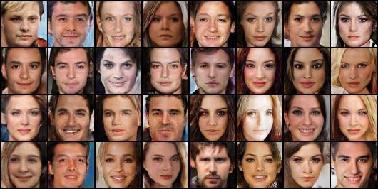

# GAN, ACGAN and UDA
You are given datasets of human face and digit images. You will need to implement the models of both GAN and ACGAN for generating human face images, and the model of DANN for classifying digit images from different domains.

  

For more details, please view hw3_R07921052.pdf for results and experiments.

### Evaluation
To evaluate your UDA models in Problems 3 and 4, you can run the evaluation script provided in the starter code by using the following command.

    python3 hw3_eval.py $1 $2

 - `$1` is the path to your predicted results (e.g. `hw3_data/digits/mnistm/test_pred.csv`)
 - `$2` is the path to the ground truth (e.g. `hw3_data/digits/mnistm/test.csv`)

Note that for `hw3_eval.py` to work, your predicted `.csv` files should have the same format as the ground truth files we provided in the dataset as shown below.

| image_name | label |
|:----------:|:-----:|
| 00000.png  | 4     |
| 00001.png  | 3     |
| 00002.png  | 5     |
| ...        | ...   |

### Submission Format
Aside from your own Python scripts and model files, you should make sure that your submission includes *at least* the following files in the root directory of this repository:
 1.   `hw3_<StudentID>.pdf`  
The report of your homework assignment. Refer to the "*Grading*" section in the slides for what you should include in the report. Note that you should replace `<StudentID>` with your student ID, **NOT** your GitHub username.
 1.   `hw3_p1p2.sh`  
The shell script file for running your GAN and ACGAN models. This script takes as input a folder and should output two images named `fig1_2.jpg` and `fig2_2.jpg` in the given folder.
 1.   `hw3_p3.sh`  
The shell script file for running your DANN model. This script takes as input a folder containing testing images and a string indicating the target domain, and should output the predicted results in a `.csv` file.
 1.   `hw3_p4.sh`  
The shell script file for running your improved UDA model. This script takes as input a folder containing testing images and a string indicating the target domain, and should output the predicted results in a `.csv` file.

We will run your code in the following manner:

    bash ./hw3_p1p2.sh $1
    bash ./hw3_p3.sh $2 $3 $4
    bash ./hw3_p4.sh $2 $3 $4

-   `$1` is the folder to which you should output your `fig1_2.jpg` and `fig2_2.jpg`.
-   `$2` is the directory of testing images in the **target** domain (e.g. `hw3_data/digits/mnistm/test`).
-   `$3` is a string that indicates the name of the target domain, which will be either `mnistm`, `usps` or `svhn`. 
	- Note that you should run the model whose *target* domain corresponds with `$3`. For example, when `$3` is `mnistm`, you should make your prediction using your "USPS→MNIST-M" model, **NOT** your "MNIST-M→SVHN" model.
-   `$4` is the path to your output prediction file (e.g. `hw3_data/digits/mnistm/test_pred.csv`).

